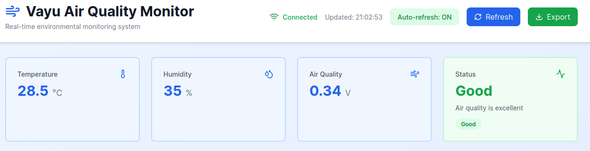
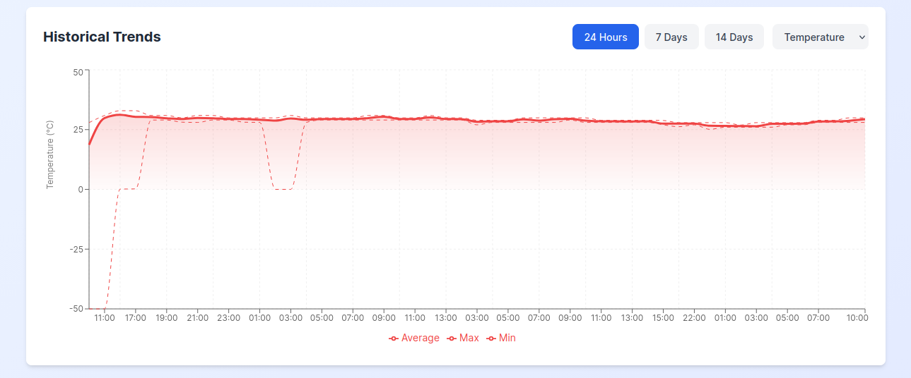
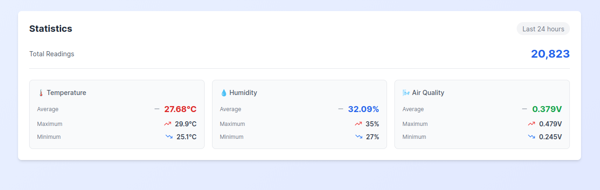
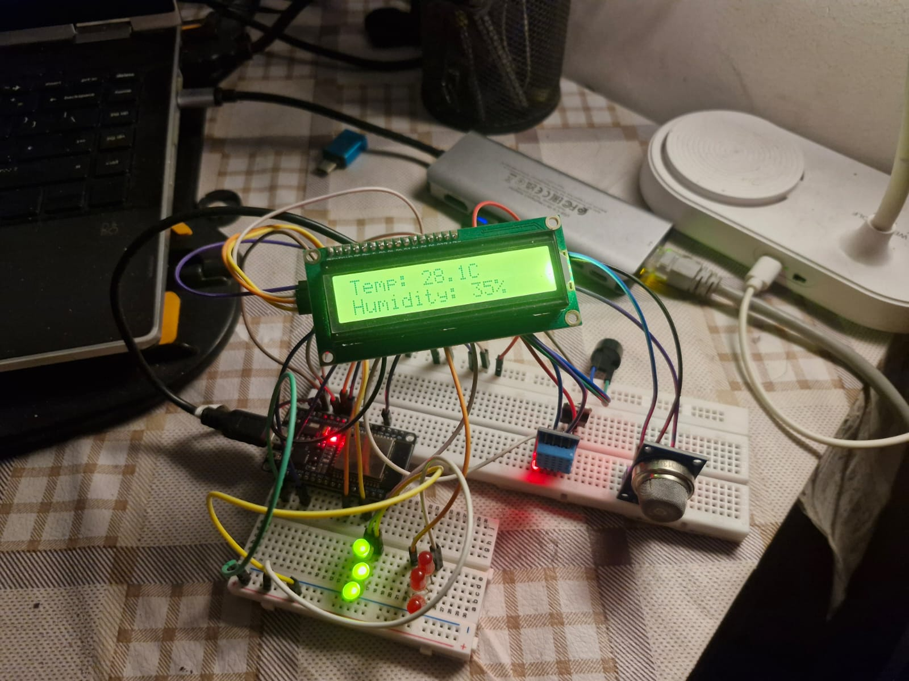

# 🌬️ Vayu Air Quality Monitor

A comprehensive real-time air quality monitoring system built with ESP32, FastAPI, and React. Monitor temperature, humidity, and air quality with beautiful visualizations and historical data analysis.

   


## ✨ Features

### Real-Time Monitoring
- **Live Sensor Data**: Temperature, humidity, and air quality readings every 2 seconds
- **Visual Indicators**: LED indicators and LCD display on ESP32
- **Audio Alerts**: Buzzer alerts for poor air quality
- **Auto-Refresh Dashboard**: Automatic updates every 5 seconds

### Data Visualization
- **Live Charts**: Real-time line charts for the last hour
- **Historical Trends**: Area charts with 24-hour, 7-day, and 14-day views
- **Interactive Controls**: Toggle between different metrics and time ranges
- **Statistics Dashboard**: Min/Max/Average calculations

### Data Management
- **Automatic Aggregation**: Hourly and daily data aggregation
- **Smart Retention**: 24-hour raw data, 7-day hourly, 14-day daily aggregates
- **CSV Export**: Download historical data for external analysis
- **Database Optimization**: Automatic cleanup and indexing

### Alerts & Monitoring
- **Air Quality Classification**: Good, Moderate, Poor
- **Connection Status**: Real-time backend connectivity indicator
- **Health Checks**: System health monitoring endpoint

## 🏗️ System Architecture

```
┌─────────────────────────────────────────────────────────┐
│  ESP32 (Sensor Node)                                    │
│  ├─ DHT11 (Temperature & Humidity)                      │
│  ├─ MQ135 (Air Quality)                                 │
│  ├─ LCD Display (16x2)                                  │
│  ├─ LED Indicators                                      │
│  └─ WiFi Communication                                  │
└────────────┬────────────────────────────────────────────┘
             │ HTTP POST (JSON) every 2 seconds
             ↓
┌─────────────────────────────────────────────────────────┐
│  FastAPI Backend (Python 3.10+)                         │
│  ├─ RESTful API                                         │
│  ├─ Async SQLAlchemy ORM                                │
│  ├─ Background Tasks (Aggregation/Cleanup)              │
│  └─ CORS Middleware                                     │
└────────────┬────────────────────────────────────────────┘
             │
             ↓ SQLite Database
┌─────────────────────────────────────────────────────────┐
│  Database Layer                                          │
│  ├─ sensor_readings (raw data)                          │
│  ├─ hourly_aggregates (7-day retention)                 │
│  └─ daily_aggregates (14-day retention)                 │
└────────────┬────────────────────────────────────────────┘
             │ REST API
             ↑
┌─────────────────────────────────────────────────────────┐
│  React Frontend (Vite + Recharts)                       │
│  ├─ Real-time Dashboard                                 │
│  ├─ Interactive Charts                                  │
│  ├─ Statistics Cards                                    │
│  └─ Export Functionality                                │
└─────────────────────────────────────────────────────────┘
```

## 🔧 Hardware Requirements

### ESP32 Setup
- **ESP32 Development Board** (ESP32-WROOM-32 or similar)
- **DHT11 Sensor** - Temperature & Humidity
- **MQ135 Sensor** - Air Quality (Gas sensor)
- **16x2 I2C LCD Display**
- **LEDs** - 3x Green, 3x Red 
- **Buzzer** - Active or Passive
- **Breadboard & Jumper Wires**
- **USB Cable** - For programming and power

### Pin Connections
| Component | ESP32 Pin |
|-----------|-----------|
| DHT11 Data | GPIO 4 |
| MQ135 Analog | GPIO 34 (ADC1_CH6) |
| Green LED | GPIO 12 |
| Red LED | GPIO 14 |
| Buzzer | GPIO 27 |
| LCD SDA | GPIO 21 (I2C) |
| LCD SCL | GPIO 22 (I2C) |

## 💻 Software Requirements

### Backend
- Python 3.10 or higher
- uv (Python package installer) or pip
- SQLite 3

### Frontend
- Node.js 18 or higher
- npm or yarn

### ESP32
- Arduino IDE 2.x or PlatformIO
- ESP32 Board Support

## 📥 Installation

### 1. Clone the Repository

```bash
git clone https://github.com/nxd010/Vayu.git
cd vayu
```

### 2. Backend Setup

```bash
cd backend

# Using uv (recommended)
uv init
uv sync

# Or using pip
python -m venv venv
source venv/bin/activate  # On Windows: venv\Scripts\activate
pip install -r requirements.txt

```

### 3. Frontend Setup

```bash
cd frontend

# Install dependencies
npm install

# Or using yarn
yarn install
```


## ⚙️ Configuration

### ESP32 Configuration

Edit `esp32/node.ino`:

```cpp
// WiFi credentials
const char* ssid = "YOUR_WIFI_SSID";

// Backend server URL (use your laptop's local IP)
const char* serverUrl = "http://XXX.XXX.XXX.XXX:8000/api/sensor-data";
```

**Finding your local IP:**
- Linux/Mac: `ip addr show` or `ifconfig`
- Windows: `ipconfig`

### Air Quality Thresholds

Edit in `esp32/vayu_esp32_client.ino`:

```cpp
const float AQ_GOOD_MAX = 1.0;      // Voltage threshold for "Good"
const float AQ_MODERATE_MAX = 2.0;  // Voltage threshold for "Moderate"
// Above 2.0V = "Poor"
```

## 🚀 Usage

### Starting the Backend

```bash
cd backend

source .venv/bin/activate  # On Windows: .venv\Scripts\activate

uvicorn app.main:app --reload --host 0.0.0.0 --port 8000
```

Backend will be available at: `http://localhost:8000`

API Documentation: `http://localhost:8000/docs`

### Starting the Frontend

```bash
cd frontend

npm run dev
```

Frontend will be available at: `http://localhost:5173`

### Uploading to ESP32

1. Connect ESP32 via USB
2. Open Serial Monitor (115200 baud) to see logs
3. Upload the sketch
4. Monitor the output for connection status

Expected Serial Output:
```
WiFi Connected!
IP Address: 192.168.1.102
Backend is reachable!
Current Readings:
Temperature: 25.3°C
Humidity: 62%
Air Quality: 1.23V (Good)
Data sent successfully!
```

## 📚 API Documentation

### Endpoints

#### Health Check
```http
GET /health
```
Returns system health status.

#### Sensor Data

**Get Latest Reading**
```http
GET /api/sensor-data/latest
```

**Get Time Range**
```http
GET /api/sensor-data/range?hours=1
```

**Get Hourly Aggregates**
```http
GET /api/sensor-data/hourly?hours=24
```

**Get Daily Aggregates**
```http
GET /api/sensor-data/daily?days=7
```

**Post Sensor Data** (ESP32)
```http
POST /api/sensor-data
Content-Type: application/json

{
  "temperature": 25.5,
  "humidity": 60.0,
  "airQualityVoltage": 1.2,
  "airQualityLevel": "Good"
}
```

#### Statistics
```http
GET /api/statistics?hours=24
```

#### Export
```http
GET /api/export/csv?hours=168
```

Full API documentation available at: `http://localhost:8000/docs` (Swagger UI)


## 📸 Screenshots

### Dashboard


### Historical Charts


### Statistics


### ESP32 Setup


---

